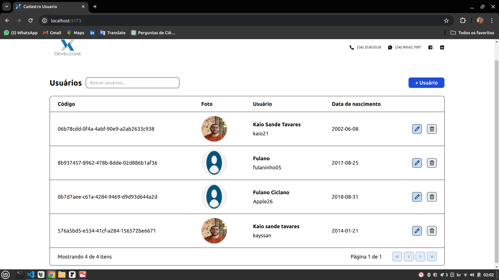
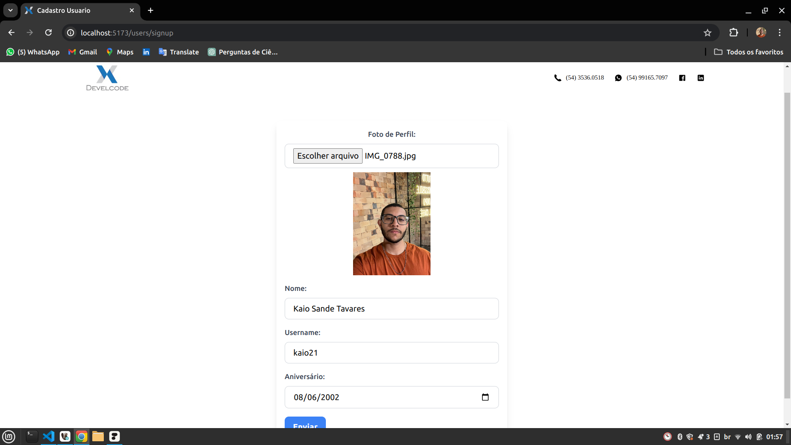
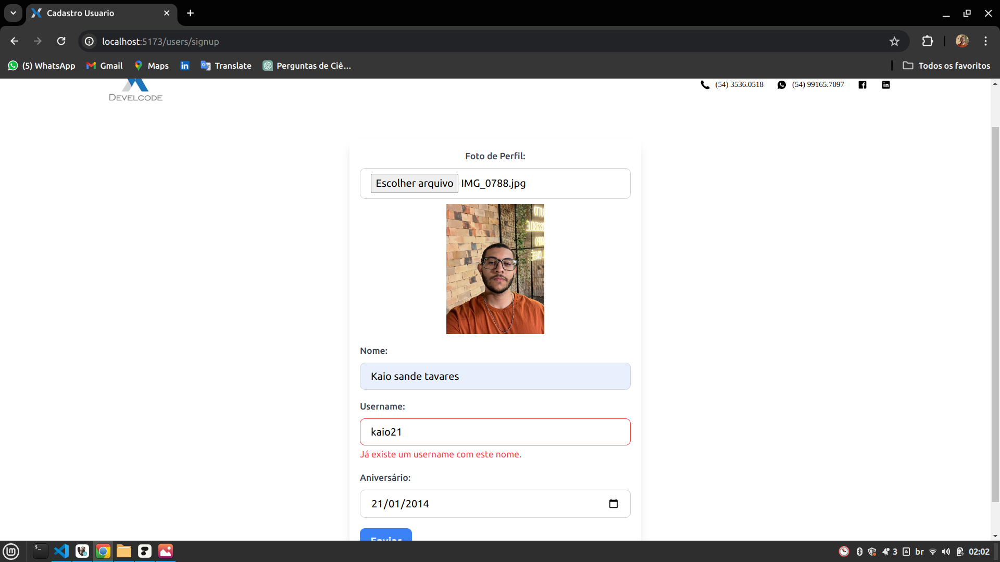

# Teste técnico [Develcode](https://www.develcode.com.br/)| Cadastro de usuário

## 👉 Funcionalidades
- Cadastro de novos usuários.
- Edição e atualização de informações do usuário.
- Exclusão de usuários.
- Visualização da lista de usuários cadastrados.
- Pesquisa e paginação da lista de usuários.

## 📝 Pré-requisitos
- Node.js v20
- Java v20
- Docker

## ⚙️ Instalação
1. Clone este projeto: https://github.com/kaiostavares/develcode
2. Instale as dependências do Node.js em `develcode-front/user-register` e Maven em `develcode-back/user-register`.

## 🚀 Execução
1. Crie e inicialize os containers:
    ```
    docker compose up -d
    ```
2. Inicialize a aplicação Spring do back-end | Porta: [http://localhost:8080](http://localhost:8080)
3. Inicialize a aplicação Vite do front-end | Porta: [http://localhost:5173](http://localhost:5173)

## 👨‍💻 Autor
Este projeto foi desenvolvido por [Kaio Tavares](https://github.com/kaiostavares).

<div align="center">
  
  
</div>
<div align="center">
  
</div>
